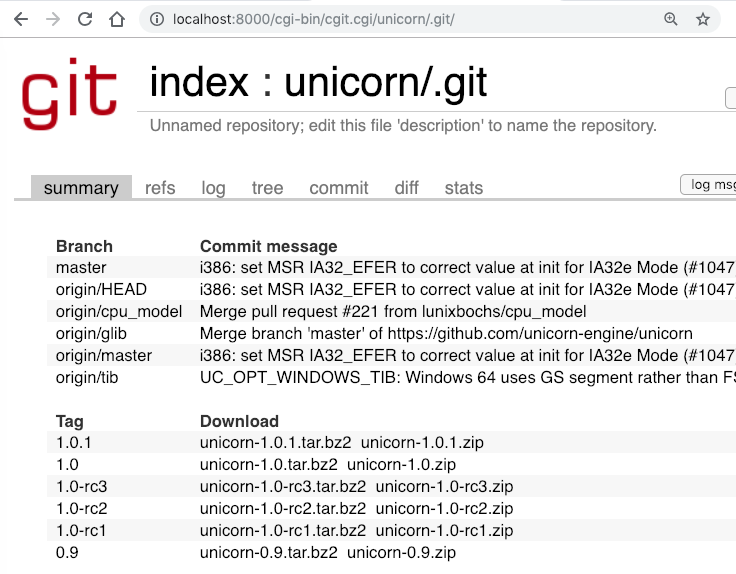

### Minimal CGI Server for cgit

This is a cgi server (`server.sh`) just for serving [cgit](https://git.zx2c4.com/cgit/).

`cgi-bin/cgit.cgi` is a precompiled mac 64-bit binary. (`make get-git all NO_GETTEXT=1 NO_LUA=1`)

### Enable syntax highlighting

* set `source-filter=filters/syntax-highlighting.py` in cgitrc, then `pip3 install pygments`

* set `source-filter=filters/syntax-highlighting.sh` in cgitrc, then `brew install highlight`

### Run

Before starting, change the `scan-path`, which will be scanned for repositories, in cgitrc.

$ ./server.sh

Open a browser and navigate to http://localhost:8000/

